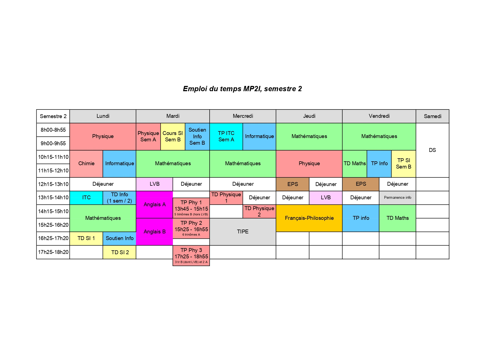

# MP2I à Paul Valéry (2023-2024)
Polycopiés de cours et quelques corrections des exercices de maths 2023-2024 en MP2I option info.\
🚨 Mon cours contient peut-être (sûrement) des erreurs, attention!!
🚨 Le cours de physique ne contient que les polycopiés, sans cours.\

## Comment utiliser ce github (pour les noobs) ?
Si vous êtes sur l'application mobile, désinstallez la immédiatement et allez sur le site.\
Allez dans les répertoires et ouvrez les fichiers .pdf seulement, les .tex servent à créer les .pdf

## Liens utiles

[Présentation de la filière / du lycée](https://mp2i.cpge-pv.fr/)\
[Cahier de Prépa](https://cahier-de-prepa.fr/mp2i-pv/)\
[Anthony Lick, cours d'informatique](https://anthonylick.com/)

[ScholarVox Sorbonne (légal)](https://univ-scholarvox-com.accesdistant.sorbonne-universite.fr/)\
[Plein de livres (illégal 👮)](https://fr.annas-archive.org/)

## Emploi du temps

